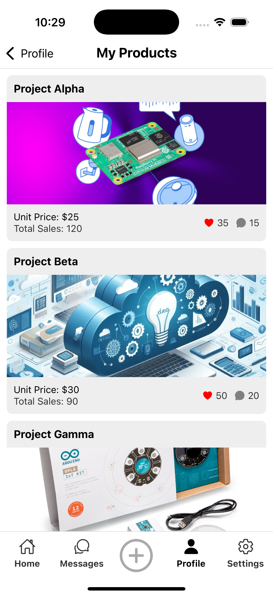

# Technology Social Network

---

## 📱 About the App
Tech Social Netowrk is an application developed for learning purposes, the goal of this app is generate all the UI for a social network when users can share and sell IT projects, chat between them and follow other ideas, even more, buy some gadgets, code, prototypes and knowledge from other users

## 📸 General Screenshots

  
  
  
  

### ✨ Feature
- In App chat to connect with others creators
  

  
  

### ✨ Feature
- Light / Dark mode
  

  
  
  
  
  
  

### ✨ Others Features
- **Stylized user interface**: A user interface designed to captivate users.
- **Credit Card validation**: Credit card validate lenght and format for al the credit card fields.

## 🔧 Technologies Used
Technology Social Network is built using the following main technologies:

| Technology       | Description                                       |
| ---------------- | ------------------------------------------------- |
| **React Native** | In-depth use of React Native implementing multiple elements |
| **Hooks** | Handle multiple hooks to build an app following best practices |
| **Styled UI** | Using two schema color, rounded cards, icons and customs styles to generate a great UI |
